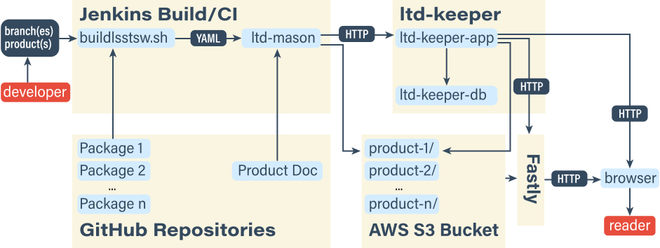
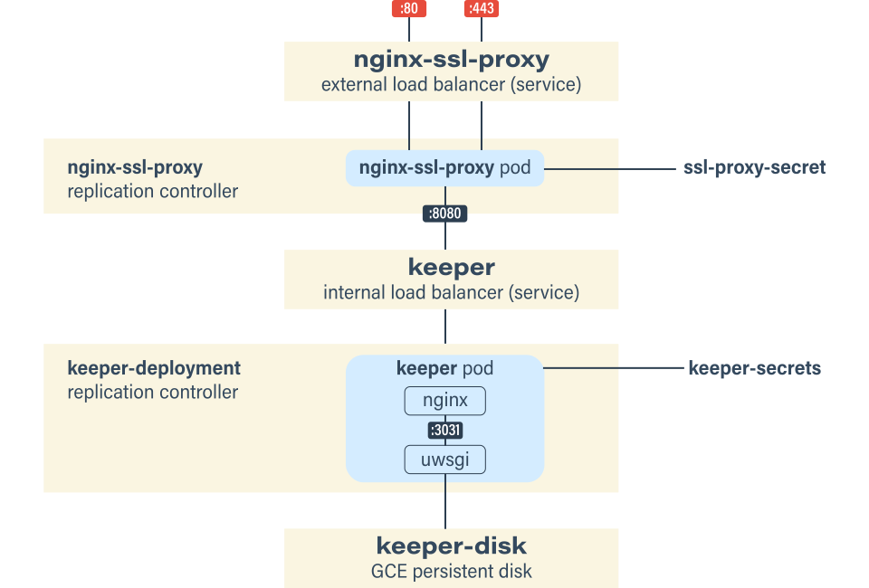

# Announcing LSST the Docs for Continuous Documentation Delivery

On behalf of the crew at SQuaRE, I'm pleased to announce *LSST the Docs,* Data Management's new documentation publishing platform. LSST the Docs will allow Data Management to create and iterate on documentation more quickly, while also giving readers a better experience.

Shortly, you'll see DM's technotes, Developer Guide, and some design documents migrate from [Read the Docs](http://readthedocs.org). In the Fall of 2016 we will begin publishing a rebooted Science Pipelines documentation site on LSST the Docs.

You can read more about the platform in [SQR-006: The LSST the Docs Platform for Continuous Documentation Delivery](https://sqr-006.lsst.io).

## Why did we build LSST the Docs?

I really admire what [Read the Docs](http://readthedocs.org) has done for open source documentation. Read the Docs has made it so much easier for developers to continuously deploy documentation alongside their projects. At one point, LSST Data Management had 39 projects published with Read the Docs. I have been, and continue to be, grateful for what Read the Docs has done for open source software and the Python ecosystem in particular.

But our experience on Read the Docs informed us of two things. First, we need flexibility in the build environment. Second, we need more automation to help manage the fleet of documents that Data Management ships.

Read the Docs is built to be an easy-to-use integrated documentation publishing service, and that integration includes the environment where documentation is built. Unfortunately, LSST Science Pipelines simply can't fit in that environment, both in term of computational resources and that LSST speaks a different build language than most Python projects (EUPS versus `pip`). We already have continuous integration services for LSST projects and it makes sense to build documentation on those as well.

Beyond EUPS, we can also envision projects where data intensive computation, testing, and figure generation are part of the documentation build process. Having flexibility in the build environment makes this possible.

We also found that Read the Docs projects needed a bit of administrative effort to provision new projects, their domain names, and set up new branch builds. While we tried to hide this administrative effort, it became a bottleneck for the team. LSST the Docs is built around an API, meaning that it's ready to automate and integrate into LSST's systems and workflows.

## What can LSST the Docs do?

Here are some of the most exciting features of the LSST the Docs platform. See [SQR-006: The LSST the Docs Platform for Continuous Documentation Delivery](https://sqr-006.lsst.io) for additional detail.

### Flexible documentation builds

Documentation can be built on any continuous integration platform. Big projects, like the LSST Science Pipelines documentation, will be built on DM's Jenkins CI. Smaller documents, like technotes, will be built on Travis CI. We've written [documentation describing how to setup a .travis.yml](https://ltd-mason.lsst.io/travis.html). We also have an elegant system for [building multi-repository documentation for EUPS-based projects](https://sqr-006.lsst.io/index.html#ltd-mason-eups).

LSST the Docs is very flexible in how documentation is built. It's a tool-agnostic static site publishing platform. Even Sphinx isn't a hard dependency, meaning that alternative formats, like LaTeX documents, can be published too. 

### Beautiful, versioned URLs

Every documentation project has its own subdomain on `lsst.io`, for example [ltd-keeper.lsst.io](https://ltd-keeper.lsst.io) or [sqr-006.lsst.io](https://sqr-006.lsst.io). These URLs are memorable and mean you won't need a link shortener to refer to projects.

From these domains we publish multiple *editions* of documentation that map to branches on GitHub. The root URL, `example.lsst.io/`, hosts the `master` branch by default (though this is configurable). This gives us beautiful URLs by default for the canonical versions of the site we want readers to visit by default.

Documentation for *branches* of projects are published under `/v/`. For example, a release branch might be published to `example.lsst.io/v/v1/` and a ticket branch at `example.lsst.io/v/DM-1234/`. Documentation for branches will be published automatically as soon as you push to GitHub. I think this feature will be tremendously valuable for documentation reviews during pull requests.

As a bonus, we retain old documentation builds. Builds are published to `example.lsst.io/builds/(id)/`. This will be helpful for seeing, and sharing, A/B comparisons in your documentation. It also means that if one of the main documentation editions breaks we can immediately hot-swap to any previous documentation build *without having to rebuild the documentation from scratch.*

And don't worry, we'll add `<link rel="canonical" href="...">` headers for our HTML templates to [help search engines sort through our documentation versions](https://sqr-006.lsst.io/index.html#canonical-urls).

### Served by Fastly

To give readers the best experience we're using the [Fastly](https://www.fastly.com) content distribution network for everything published by LSST the Docs. Whether you're West Coast, East Coast, down in Chile, over in France, or anywhere else on Earth, [there will be a nearby Fastly point of presence](https://www.fastly.com/services/modern-network-design) serving you docs.

Besides performance, we're also taking advantage of the [Varnish](https://www.varnish-cache.org/) caching layer that Fastly hosts. Varnish lets us map URLs for all documentation projects, and their individual builds, to directories on a *single* AWS S3 bucket ([see SQR-006 for details](https://sqr-006.lsst.io/index.html#fastly-cdn)). This will allow us to scale LSST the Docs to host an enormous number of projects without breaking a sweat. ([Hat tip to HashiCorp for advocating this pattern](https://www.hashicorp.com/blog/serving-static-sites-with-fastly.html).)

Last but not least, Fastly allows us to securely deliver content over TLS (i.e., HTTPS). This is nice to have for static documentation projects, but will become critical for serving interactive content with React and the like.

### API Driven

Starting with our earliest whiteboard design sessions, we knew that LSST the Docs needed to be decomposed into discrete microservices with well-defined interfaces. This design gives us flexibility, and isolates details. For example, LSST the Docs can publish documentation for EUPS projects without having to be aware of EUPS. The microservices design also means there are a lot of independent parts. Below is an architectural diagram describing how an EUPS-based documentation project, like the Science Pipelines, is published by LSST the Docs.

At the heart of LSST the Docs is [LTD Keeper](https://ltd-keeper.lsst.io), a RESTful web app. LTD Keeper maintains the state of documentation projects and builds, and coordinates the builders on CI servers ([LTD Mason](https://ltd-mason.lsst.io)) and other web services (AWS S3 and Route 53 and Fastly).

Not only can this API be used internally by LSST the Docs to publish and maintain documentation builds, it can also be used by external services. Documents can use this API to help readers find the right version of the docs. Dashboards can use the API to list documentation projects and their versions. Even ChatOps bots could use this API.

### Deployed with Kubernetes

Being my first major DevOps project, I wanted to cultivate modern best practices for deploying applications to the web. We decided to deploy the LTD Keeper API server (built on [Flask](http://flask.pocoo.org) in Python 3) in Docker containers orchestrated by [Kubernetes](http://kubernetes.io). This is all done in the [Google Container Engine](https://cloud.google.com/container-engine/). Below is a diagram of what the application deployment looks like.

As shown, a Kubernetes Load Balancer service receives traffic from the internet and routes it to pods with Nginx containers that terminate TLS traffic. These forward the traffic, via another internal load balancer, to pods composed of a docker container that reverse-proxies traffic and finally a container with the uWSGI-run Flask application. All of the pods are managed by Kubernetes replication controllers, meaning that it's easy to scale the number of pods, and also to deploy updated pods without service interruptions.

The *best* part is that this entire infrastructure is configured and managed on the command line with a few YAML files. The LTD Keeper documentation contains complete [deployment instructions](https://ltd-keeper.lsst.io/index.html#ops-guide).

I couldn't be happier with Kubernetes, and I believe that this deployment architecture will be a useful template for future SQuaRE projects.

## Onwards

With LSST the Docs, we are at last in a position to move forward on DM's documentation projects, not least of which will be a reboot of the LSST Science Pipelines documentation. We look forward to migrating Science Pipelines to Sphinx during the Fall 2016 development cycle.

This platform will also enable exciting integrations and automations for the [LSST DM Technote platform (SQR-000)](https://sqr-000.lsst.io) and the [DocHub project (SQR-011)](https://sqr-011.lsst.io) for LSST documentation search and discovery.

We're also continuously improving LSST the Docs. The Fall 2016 [DM-5858](https://jira.lsstcorp.org/browse/DM-5858) epic lists some of the planned work, including [dashboards for listing documentation versions and builds](https://jira.lsstcorp.org/browse/DM-5895).

### Get the code and read the docs

LSST the Docs code is MIT-Licensed open source. It's built either natively for, or compatible with, Python 3. Here are the main repositories and their documentation:

- **LTD Mason**
	- Docs: [https://ltd-mason.lsst.io](https://ltd-mason.lsst.io).
	- GitHub: [https://github.com/lsst-sqre/ltd-mason](https://github.com/lsst-sqre/ltd-mason)
- **LTD Keeper**
	- Docs: [https://ltd-keeper.lsst.io](https://ltd-keeper.lsst.io).
	- GitHub: [https://github.com/lsst-sqre/ltd-keeper](https://github.com/lsst-sqre/ltd-keeper).
	- Docker Hub:
		- [https://hub.docker.com/r/lsstsqre/ltd-keeper/](https://hub.docker.com/r/lsstsqre/ltd-keeper/)
		- [https://hub.docker.com/r/lsstsqre/nginx-python/](https://hub.docker.com/r/lsstsqre/nginx-python/)

You can [follow the progress of LSST the Docs on JIRA by searching for the label: 'lsst-the-docs.'](https://jira.lsstcorp.org/issues/?jql=labels%20%3D%20lsst-the-docs%20ORDER%20BY%20key%20ASC)

The technote describing this project, its philosophy, architecture, and implementation is available at [https://sqr-006.lsst.io](https://sqr-006.lsst.io).

🖖